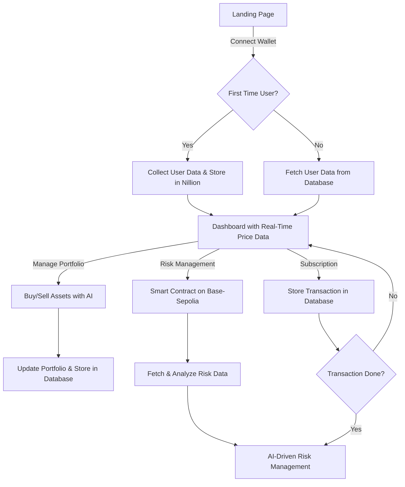

# TradeSync

🚀 **TradeSync** is a decentralized AI-powered trading platform that seamlessly integrates risk management and autonomous trading. It leverages **Warden AI Agent Kit**, **Nillion**, and **Base-Sepolia** smart contracts to ensure secure, efficient, and autonomous trading experiences.

## 🔥 Features

- **Wallet Connection**: Users land on the **Landing Page** and connect their wallets.
- **User Data Collection**: First-time users provide necessary data, which is securely stored in **Nillion**.
- **Dashboard**: Displays **real-time price data** and provides access to portfolio management.
- **AI-Powered Trading**: Users can buy/sell assets with **AI-driven autonomous trading**.
- **Risk Management**: Smart contract-based risk management deployed on **Base-Sepolia**.
- **Subscription Model**: Users can subscribe, with transactions recorded in the database.
- **AI Risk Analysis**: AI-driven risk assessment based on on-chain data.

---

## 🛠️ Tech Stack

### **Frontend**  
- [Next.js](https://nextjs.org/) - React-based framework for a fast and scalable frontend.

### **Backend**  
- [Express.js](https://expressjs.com/) - Lightweight and efficient server-side framework.

### **Database**  
- [Nillion](https://docs.nillion.com/quickstart) - Secure computation network for decentralized trust in high-value data storage.

### **AI Agent**  
- [Warden AI Agent Kit](https://docs.wardenprotocol.org/) - Framework for building AI-driven autonomous trading agents.
  - Simplifies on-chain AI-powered trading.
  - Integrates **LangChain** for AI-powered decision-making.

### **Smart Contracts**  
- **Base-Sepolia (ThirdWeb)** - Solidity-based smart contracts for **risk management and automated trading**.
- **Here Is The Deployed Contract** - [Click Here](https://thirdweb.com/base-sepolia-testnet/0x8920939ebb4Bfa884aB4e93f9b1c628C286796CC)

---

## **Demonstration**
- [Demo](https://drive.google.com/file/d/1ZHsEsuUqkXO6HT5r6fJUOWMYichQQQOg/view?usp=sharing)

## 📌 Flow Diagram

**Happy Trading! 🚀💰**
